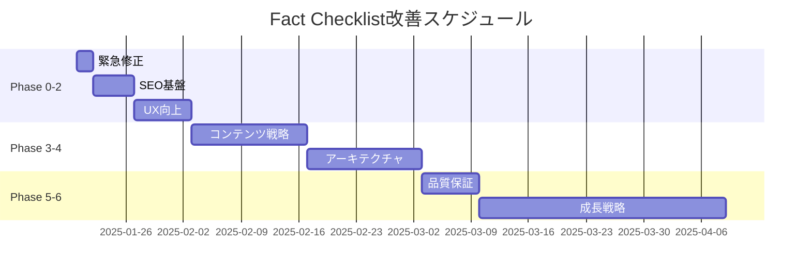

# Fact Checklist 包括的改善計画

## 概要

このドキュメントは、Fact
Checklistプロジェクトの技術的改善とマーケティング戦略を統合した包括的な改善計画です。Claude
Codeが各フェーズを順次実行できるよう、具体的なタスクに分解しています。

````markdown
# Claude Code実行ガイド

このドキュメントは、Fact Checklistプロジェクトの改善計画です。Claude
Codeは各フェーズを順番に実行してください。

## 🎯 現在の優先事項（2025年7月）

1. **Phase 0を完了させる**（TypeScript警告の解消）
2. **Phase 1を開始する**（SEO対策）

## 📋 実行方法

### 基本コマンド

- 「Phase 0を実行してください」
- 「Phase 1のタスク1.1を実装してください」
- 「現在の進捗を確認してください」

### 実行ルール

1. **必ず順番に実行**（Phase 0 → 1 → 2...）
2. **小さな単位でコミット**
3. **各タスク後に動作確認**
4. **ビルドエラーが出たら即修正**

## ⚡ クイックスタート

```bash
# 最初に実行すべきコマンド
npm install
npm run lint  # 現在の警告を確認
npm run dev   # 開発環境で動作確認
```
````

その後、Phase 0から順番に実行してください。

---

以下、詳細な改善計画が続きます。

## 現在の状況（2025年8月時点）

- **総合進捗率**: 約60%
- **技術基盤**: Svelte5 + TypeScript + PWA（堅実）
- **完了項目**:
  - ✅ SEO対策実装完了（メタタグ、sitemap、robots.txt）
  - ✅ TypeScript/ESLint厳格化設定
  - ✅ 言語永続化とSSR/CSR同期
- **残課題**: TypeScript警告の完全解消、E2Eテスト実装

## フェーズ構成

### 🚨 Phase 0: 緊急修正事項（進行中）

**目的**: 本番環境での致命的な問題を解決

#### タスクリスト

- [x] TypeScript/ESLint厳格化設定完了
- [ ] TypeScript警告の解消（残り約20件）
  - 未使用変数の削除
  - 型定義の追加
  - 非nullアサーション（`!`）の適切な置き換え
- [ ] ESLintエラーを0にする
  - `npm run lint:strict`が成功するまで修正
- [x] プロダクションビルドの最終確認

### ✅ Phase 1: SEO基盤構築（完了）

**目的**: 検索エンジンでの可視性を向上させる

#### 1.1 メタタグ・OGP最適化 ✅

- [x] 動的なメタタグ生成（12言語対応）
- [x] 多言語対応のhreflangタグ
- [x] Twitter Card対応
- [x] 構造化データ（JSON-LD）の実装

#### 1.2 技術的SEO改善 ✅

- [x] 動的サイトマップ生成（/sitemap.xml）
- [x] 多言語URL対応
- [x] robots.txt最適化
- [x] サイトマップ参照追加

#### 1.3 Google Search Console設定

- サイトマップ送信
- インデックス登録リクエスト
- エラーの確認と修正

### 💫 Phase 2: ユーザー体験向上（1週間）

**目的**: 訪問者を惹きつけ、利用を促進する

#### 2.1 ランディングページの改善

```svelte
<!-- src/lib/components/HeroSection.svelte -->
- モダンなヒーローセクション実装 - アニメーション追加（Svelte transition） - CTAボタンの最適化
- 信頼性指標の表示（利用者数、評価等）
```

#### 2.2 ソーシャル共有機能

```typescript
// src/lib/components/ShareButtons.svelte
-Twitter / X共有 -
  Facebook共有 -
  LinkedIn共有 -
  ネイティブ共有API対応 -
  OGP画像の自動生成;
```

#### 2.3 パフォーマンス最適化

```typescript
// vite.config.ts
- コード分割の最適化
- 画像の最適化（WebP対応）
- Critical CSSの実装
- Web Vitalsの改善
```

#### 2.4 PWAインストール促進

```svelte
<!-- src/lib/components/InstallPrompt.svelte -->
- カスタムインストールバナー - インストール後の特典表示 - オフライン機能の説明
```

### 📊 Phase 3: コンテンツ戦略（2週間）

**目的**: SEOトラフィックとユーザーエンゲージメントを増加

#### 3.1 ブログセクション構築

```
src/routes/blog/
├── +page.svelte          # 記事一覧
├── [slug]/+page.svelte   # 記事詳細
├── _posts/               # Markdown記事
└── rss.xml/+server.ts    # RSSフィード
```

**初期記事案**:

1. 「SNS時代のファクトチェック：なぜ今必要なのか」
2. 「ChatGPTの回答は信頼できる？AIとファクトチェック」
3. 「フェイクニュース事例研究：2024年の教訓」
4. 「子供に教えたい情報リテラシー：家庭でできる5つの方法」

#### 3.2 事例・ガイドページ

```
src/routes/guides/
├── for-students/     # 学生向けガイド
├── for-journalists/  # ジャーナリスト向け
├── for-business/     # 企業向け
└── case-studies/     # 実践事例
```

#### 3.3 多言語コンテンツ充実

- 各言語での独自コンテンツ作成
- ローカライズされたキーワード対策
- 地域別の事例追加

### 🏗️ Phase 4: アーキテクチャ改善（2週間）

**目的**: 保守性と拡張性の向上

#### 4.1 コード構造の最適化

```
src/
├── domain/           # ビジネスロジック分離
│   ├── models/
│   ├── services/
│   └── validators/
├── infrastructure/   # 外部依存の抽象化
│   ├── storage/
│   └── pdf/
└── presentation/     # UI層の整理
    ├── components/
    ├── stores/
    └── routes/
```

#### 4.2 PDF生成の統合

```typescript
// src/lib/pdf/index.ts
- 重複コードの削除
- 統一インターフェース実装
- プラットフォーム別戦略パターン
- ファイルサイズ削減（568行→300行以下）
```

#### 4.3 状態管理の改善

```typescript
// src/lib/stores/app.store.ts
-統合ストア実装 - 永続化ミドルウェア - 開発者ツール対応;
```

### 🧪 Phase 5: 品質保証（1週間）

**目的**: バグの削減と信頼性の向上

#### 5.1 テスト実装

```
src/__tests__/
├── unit/           # 単体テスト
├── integration/    # 統合テスト
└── e2e/           # E2Eテスト（Playwright）
```

**優先テスト対象**:

- チェックリスト作成フロー
- スコア計算ロジック
- PDF生成機能
- 多言語切り替え

#### 5.2 CI/CD強化

```yaml
# .github/workflows/ci.yml
- 型チェック
- Lintチェック
- テスト実行
- ビルド検証
- Lighthouse CI
- 自動デプロイ
```

### 📈 Phase 6: 成長戦略（1ヶ月）

**目的**: ユーザー獲得と定着

#### 6.1 分析基盤構築

```typescript
// src/lib/analytics/
-プライバシー重視の分析実装 - 利用統計ダッシュボード - A / Bテスト基盤;
```

#### 6.2 マーケティング施策

- プレスリリース配信
- 技術記事の投稿（Qiita、Zenn）
- SNSアカウント運用
- インフルエンサー連携

#### 6.3 API公開

```typescript
// src/routes/api/v1/
- REST API実装
- 開発者向けドキュメント
- SDKの提供
```

### 🚀 Phase 7: スケール対応（将来）

**目的**: 大規模利用への対応

#### 7.1 エンタープライズ機能

- チーム機能
- 管理者ダッシュボード
- カスタマイズ機能
- SLA対応

#### 7.2 収益化検討

- プレミアムプラン
- API利用料
- カスタマイズサービス
- 教育機関向けライセンス

## 実行スケジュール



## 成功指標（KPI）

### 短期目標（1ヶ月）

- [ ] Google Search Console表示回数: 1,000回/月
- [ ] 月間訪問者数: 500人
- [ ] Lighthouseスコア: 全項目90以上
- [ ] チェックリスト作成数: 100件/月

### 中期目標（3ヶ月）

- [ ] 月間訪問者数: 5,000人
- [ ] オーガニック流入: 70%以上
- [ ] リピート率: 30%以上
- [ ] 被リンク数: 50件

### 長期目標（6ヶ月）

- [ ] 月間訪問者数: 20,000人
- [ ] 多言語利用率: 20%以上
- [ ] API利用開発者: 100人
- [ ] メディア掲載: 10件以上

## Claude Codeへの実行指示

各フェーズの開始時に以下のコマンドを実行：

```bash
# Phase 0の開始
claude-code execute --phase 0 --file improvement.md

# 進捗確認
claude-code status --phase 0

# 次のフェーズへ
claude-code execute --phase 1 --file improvement.md
```

## 注意事項

1. **各フェーズは前のフェーズの完了を前提**とする
2. **小さなPRで段階的に実装**（大きな変更は避ける）
3. **既存機能を壊さない**ことを最優先
4. **ユーザーフィードバックを随時反映**
5. **パフォーマンスを常に監視**

この計画に従って着実に実装を進めることで、Fact
Checklistを価値あるサービスに成長させることができます。
